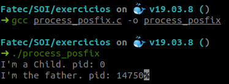

# Sistemas Operacionais I - Exercício 1

---

Atividade proposta pelo [Professor Diogo Branquinho](https://github.com/diogobranquinho) da FATEC São José dos Campos - Prof. Jessen Vidal.

---
Elabore um programa em Linux que crie um processo e execute um segundo programa.

[process_poxfix.c](process_poxfix.c)

  
a) Explique o código fonte utilizado

    Em pid = fork(), está sendo criado um processo filho que é a cópia do endereço de memória do processo base.

    No if (pid < 0) é para quando ocorrer da criação do processo filho falhar, ao falhar o código retornado é menor que zero.

    No else if (pid == 0), quando o processo filho é criado com sucesso, o valor do pid é igual a zero.
    Assim, ao entrar nesta verificação é printado uma frase no terminal, através do método "printf".

    Na última verificação, else, é para quando o valor do pid é maior que zero.
    Em wait(NULL) o processo pai entra na filha de espera para ser executado, esperando o processo filho terminar.
    Quando o processo filho é finalizado com sucesso é retonado uma mensagem no terminal e finalizado a execução do programa.

  
b) Descreva os resultados obtidos

  
    Ao criar o processo é retornado o pid do processo filho e do pai. São processos distintos, demonstrado pelo diferença no process id de cada programa.

  

---
Elabore um programa em Windows que crie um processo e execute um segundo programa.

[process_win32.c](process_win32.c)

  
a) Explique o código fonte utilizado

  
    Se CreateProcess for bem-sucedido, ele retornará uma estrutura
    PROCESS_INFORMATION contendo identificadores e identificadores para o novo
    processo. Os identificadores de processo são criados com direitos de acesso total,
    mas o acesso pode ser restrito ao especificar descritores de segurança. Quando
    você não precisar mais dessas handle (identificador), deve-se fechar a
    comunicação usando o método CloseHandle.

---
Elabore um programa em Java que crie um processo e execute um segundo programa.

[process.java](process.java)

  
a) Explique o código fonte utilizado

  
    O objeto OSProcess representa um nó na árvore de processos. Ele conhece
    informações sobre o processo que representa e também quais são seus filhos.

---
Elabore um programa em Python que crie um processo e execute um segundo programa.

[process.py](process.py)

  
a) Explique o código fonte utilizado

    O método fork() é usado para criar processos e está disponível no módulo os.
    É feito a verificação do processo, para diferenciá-los.
    O método getpid() retorna o process ID.

  
b) Descreva os resultados obtidos

  
    É retornado id do processo pai e filho.

